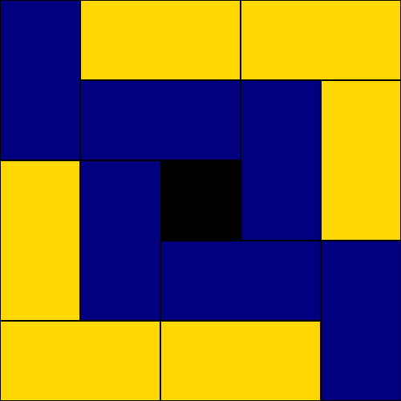
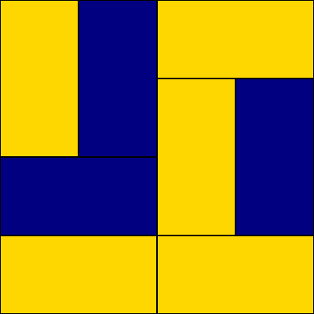
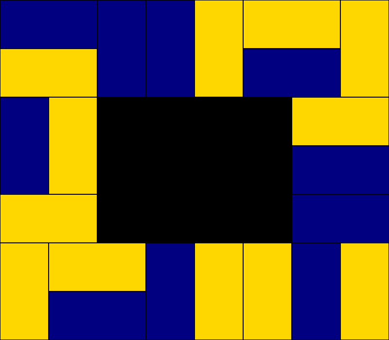

# Holey rectangle domino tiling
A $m \times n$ holey rectangle is a $m \times n$ rectangle with the center $(m-4) \times (n-4)$ rectangle removed, Given a $m \times n$ holey rectangle, this script generates a random domino tiling and calculates the total number of tilings for this figure.

## Technology used

The script is written in python, It uses the random and the Pillow libraries to create the tiling and the SymPy library to calculate the number of tilings.\
You can change the colors of the dominoes and the size of the holey rectangle, $n$ and $m$ must be greater or equal than 5, technically the script can generate tilings of a $4 \times 4$ square (since it is a degenerate case of the holey rectangle), but errors may happen.

## Number of tilings

Given a $m \times n$ holey rectangle the number of tilings is: 

$(F_{n-1}F_{m-1} + F_{n-2}F_{m-2} + F_{n-3}F_{m-3})^2 + 2(1+(-1)^{n+m+1})$.

The case when $n=m$ (a holey square) was proved by Roberto Tauraso in 2004, I give a proof of the general case in my thesis.

## Further reading

[A New Domino Tiling Sequence](https://cs.uwaterloo.ca/journals/JIS/VOL7/Tauraso/tauraso3.html) - Proof by Roberto Tauraso.\
[Enumeración de teselaciones del diamante azteca y otros tableros](https://tesiunamdocumentos.dgb.unam.mx/ptd2026/ene_mar/0883018/Index.html) - My thesis (in Spanish).

